# Babylon.js 架构设计与开发实践指南

## 一、项目概述与核心价值

Babylon.js是一个功能强大、开源的Web 3D渲染引擎，由微软主导开发，完全基于Web标准构建，无需任何插件即可在现代浏览器中运行。它允许开发者快速创建复杂的3D场景、游戏、虚拟现实(VR)、增强现实(AR)应用，以及各种交互式3D体验。

### 核心价值
- **零门槛**：基于JavaScript/TypeScript，Web开发者可以无缝迁移
- **全功能**：涵盖从基础渲染到高级物理、动画、AI的全套3D功能
- **跨平台**：支持所有现代浏览器、移动设备、VR/AR设备，甚至原生应用
- **高性能**：内置多种优化机制，支持WebGL和新一代WebGPU渲染
- **活跃生态**：丰富的文档、示例、社区资源和第三方扩展

---

## 二、整体架构图

```mermaid
graph TD
    A[应用层] --> B[高级功能层]
    B --> C[核心场景层]
    C --> D[渲染引擎层]
    D --> E[底层基础层]

    subgraph E[底层基础层]
        E1[数学库 Maths]
        E2[工具库 Misc]
        E3[缓冲管理 Buffers]
        E4[状态管理 States]
    end

    subgraph D[渲染引擎层]
        D1[引擎核心 Engines]
        D2[着色器系统 Shaders/WGSL]
        D3[渲染管理 Rendering]
        D4[剔除优化 Culling]
    end

    subgraph C[核心场景层]
        C1[节点系统 Node]
        C2[场景管理 Scene]
        C3[相机系统 Cameras]
        C4[光源系统 Lights]
        C5[网格系统 Meshes]
        C6[材质系统 Materials]
        C7[组件系统 Behaviors]
    end

    subgraph B[高级功能层]
        B1[动画系统 Animations]
        B2[骨骼动画 Bones]
        B3[粒子系统 Particles]
        B4[音频系统 AudioV2]
        B5[物理引擎 Physics]
        B6[碰撞检测 Collisions]
        B7[资源加载 Loaders]
        B8[后处理效果 PostProcesses]
    end

    subgraph A[应用层]
        A1[GUI系统 GUI]
        A2[VR/AR支持 XR]
        A3[导航系统 Navigation]
        A4[流图系统 FlowGraph]
        A5[帧图系统 FrameGraph]
        A6[调试工具 Inspector]
        A7[扩展插件 Addons]
    end

    style E fill:#e1f5fe,stroke:#01579b
    style D fill:#e8f5e9,stroke:#2e7d32
    style C fill:#fff3e0,stroke:#ef6c00
    style B fill:#f3e5f5,stroke:#7b1fa2
    style A fill:#ffebee,stroke:#c62828
```



### 架构分层说明
1. **底层基础层**：提供最基础的数学运算、工具函数、数据缓冲和渲染状态管理，所有上层功能都基于这一层构建
2. **渲染引擎层**：封装WebGL/WebGPU底层API，管理着色器、渲染调度和性能优化，屏蔽不同渲染API的差异
3. **核心场景层**：定义3D场景的核心元素，包括场景管理、节点系统、各种场景对象（相机、灯光、网格等）
4. **高级功能层**：构建在核心场景之上的高级功能，包括动画、物理、粒子、音频、资源加载等
5. **应用层**：面向最终开发者的高级功能和工具，包括GUI、VR/AR、可视化编程、调试工具等

---

## 三、核心模块详细介绍

### 1. 核心引擎模块 (`@babylonjs/core`)
整个引擎的基础模块，包含所有核心功能：
- **关键入口类**：
  - `Engine`：渲染引擎核心，管理渲染上下文和底层API
  - `Scene`：场景管理类，是所有3D内容的容器
  - `Node`：所有场景对象的基类，提供通用功能
- **核心功能**：基础渲染、场景管理、数学运算、输入处理、资源管理等
- **文件路径**：`packages/dev/core/src/`

### 2. 材质系统模块 (`@babylonjs/materials`)
提供高级材质和渲染效果：
- **关键类**：`PBRMaterial`、`StandardMaterial`、`CustomMaterial`
- **功能**：物理基于渲染(PBR)、自定义着色器、各种特殊效果材质
- **文件路径**：`packages/dev/materials/src/`

### 3. 资源加载模块 (`@babylonjs/loaders`)
支持各种3D资源格式加载：
- **支持格式**：.babylon、glTF/glB、OBJ、STL等
- **关键类**：`AssetsManager`、`SceneLoader`
- **功能**：异步资源加载、加载进度管理、资源缓存
- **文件路径**：`packages/dev/loaders/src/`

### 4. GUI系统模块 (`@babylonjs/gui`)
2D用户界面系统：
- **关键类**：`AdvancedDynamicTexture`、`Button`、`Slider`、`TextBlock`
- **功能**：UI控件、布局系统、样式管理、交互事件
- **文件路径**：`packages/dev/gui/src/`

### 5. 后处理模块 (`@babylonjs/post-processes`)
屏幕后处理效果：
- **效果**： Bloom、景深、抗锯齿、颜色校正、运动模糊等
- **关键类**：`DefaultRenderingPipeline`、`PostProcess`
- **文件路径**：`packages/dev/postProcesses/src/`

### 6. 扩展插件模块 (`@babylonjs/addons`)
高级功能扩展：
- **功能**：大气渲染、HTML网格、MSDF文本、导航系统、物理引擎扩展
- **文件路径**：`packages/dev/addons/src/`

### 7. 调试工具模块 (`@babylonjs/inspector`)
开发和调试工具：
- **功能**：场景检查器、属性编辑器、性能分析、实时调试
- **文件路径**：`packages/dev/inspector/src/`

---

## 四、关键设计理念与设计模式分析

### 核心设计理念
1. **向后兼容性优先**：所有API变更都保证向下兼容，开发者可以放心升级
2. **性能第一**：作为3D渲染引擎，每一行代码都经过性能优化审查
3. **简单易用**：API设计尽量降低学习曲线，提供清晰的命名和直观的使用方式
4. **可扩展性**：通过插件和组件机制，支持开发者灵活扩展功能

### 关键设计模式

#### 1. 组件模式 (Component Pattern)
通过Behavior系统实现功能的模块化扩展，无需继承即可为对象添加功能：
```typescript
class RotateBehavior implements Behavior<Mesh> {
    public name = "RotateBehavior";

    public attach(target: Mesh): void {
        target.onBeforeRenderObservable.add(() => {
            target.rotation.y += 0.01;
        });
    }

    public detach(target: Mesh): void {
        target.onBeforeRenderObservable.clear();
    }
}

// 使用方式
mesh.addBehavior(new RotateBehavior());
```

#### 2. 观察者模式 (Observer Pattern)
大量使用Observable实现松耦合的事件通信：
```typescript
// 监听场景就绪事件
scene.onReadyObservable.add(() => {
    console.log("场景加载完成");
});

// 监听网格点击事件
mesh.onPointerObservable.add((eventInfo) => {
    if (eventInfo.type === PointerEventTypes.POINTERPICK) {
        console.log("网格被点击");
    }
});
```

#### 3. 抽象工厂模式 (Abstract Factory Pattern)
通过引擎工厂屏蔽不同渲染API的差异：
```typescript
// 自动选择最佳的渲染引擎（WebGL/WebGPU）
const engine = EngineFactory.Create(canvas, {
    useWebGPU: true,
    antialias: true
});
```

#### 4. 装饰器模式 (Decorator Pattern)
使用装饰器简化序列化和编辑器集成：
```typescript
@serialize("CustomMesh")
class CustomMesh extends Mesh {
    @serialize()
    public customProperty: number = 0;

    @inspectable({
        label: "自定义属性",
        type: InspectableType.Slider,
        min: 0,
        max: 100
    })
    public get customPropertyInspectable() {
        return this.customProperty;
    }
}
```

#### 5. 策略模式 (Strategy Pattern)
不同的渲染后端实现相同的抽象接口，可以灵活切换：
- `WebGLEngine` 实现WebGL渲染
- `WebGPUEngine` 实现WebGPU渲染
- `NullEngine` 实现无头渲染，用于服务端计算和测试

---

## 五、5步零基础学习路径（从初学者到大神）

### 第1步：入门基础 (1-2周)
**学习目标**：理解3D基本概念，掌握Babylon.js基础使用
**学习内容**：
1. 学习JavaScript/TypeScript基础语法
2. 理解3D基本概念：坐标系、网格、材质、纹理、相机、灯光
3. 学习Babylon.js核心概念：Engine、Scene、Mesh、Material、Light、Camera
4. 掌握Playground的使用，能够编写简单的3D场景
**实践项目**：
- 创建一个简单的3D场景，包含旋转的立方体、地面、基本光照和相机控制
- 实现简单的交互：点击立方体改变颜色
**预期成果**：能够独立创建简单的3D场景，理解Babylon.js的基本工作原理

### 第2步：核心功能掌握 (2-4周)
**学习目标**：掌握Babylon.js核心功能，能够开发中等复杂度的3D应用
**学习内容**：
1. 资源加载：使用AssetsManager加载3D模型、纹理、音频等资源
2. 材质系统：掌握PBR材质的使用，理解各种材质参数
3. 动画系统：学习关键帧动画、骨骼动画、 morph动画
4. 交互系统：掌握指针事件、碰撞检测、拾取
5. 基础性能优化：理解常见的性能优化手段
**实践项目**：
- 开发一个简单的3D产品展示页面，支持模型旋转、缩放、切换材质
- 实现简单的3D小游戏：小球吃金币
**预期成果**：能够独立开发完整的3D交互应用，掌握大部分常用API

### 第3步：高级功能应用 (4-8周)
**学习目标**：掌握高级功能，能够开发复杂的3D应用和游戏
**学习内容**：
1. 物理引擎：集成和使用物理引擎，实现碰撞、重力、关节等物理效果
2. 粒子系统：创建各种粒子效果：火焰、烟雾、爆炸、魔法效果等
3. 后处理效果：使用渲染管线实现各种视觉效果
4. GUI系统：创建复杂的2D用户界面
5. VR/AR支持：开发简单的VR/AR应用
**实践项目**：
- 开发一个第一人称3D射击游戏，包含物理碰撞、粒子特效、UI界面
- 实现一个VR全景看房应用
**预期成果**：能够独立开发复杂的3D游戏和应用，掌握大部分高级功能

### 第4步：性能优化与扩展开发 (8-12周)
**学习目标**：掌握性能优化技巧，能够扩展引擎功能
**学习内容**：
1. 深入性能优化：批处理、实例化、LOD、遮挡剔除、内存管理
2. 自定义着色器：编写GLSL/WGSL自定义着色器，实现特殊渲染效果
3. 插件开发：开发自定义的Behavior、PostProcess、材质等扩展
4. 引擎源码阅读：理解核心模块的实现原理
**实践项目**：
- 优化一个复杂场景，将帧率从30fps提升到60fps
- 开发一个自定义后处理效果插件
- 阅读核心模块源码，理解渲染循环的实现原理
**预期成果**：能够开发高性能的3D应用，能够扩展引擎功能，理解引擎内部实现

### 第5步：架构设计与贡献 (12周以上)
**学习目标**：成为Babylon.js专家，能够设计大型3D应用架构，参与引擎贡献
**学习内容**：
1. 大型3D应用架构设计：模块化、资源管理、状态管理、性能优化
2. FlowGraph和FrameGraph的使用和扩展
3. WebGPU高级特性的使用
4. 参与社区贡献：提交PR、修复bug、开发新功能
**实践项目**：
- 设计并开发一个大型3D项目的架构，支持多人协作开发
- 向Babylon.js官方仓库提交PR，修复bug或添加新功能
- 在社区分享经验，撰写技术博客
**预期成果**：成为Babylon.js领域专家，能够设计大型3D应用架构，参与引擎开发

---

## 六、全网最佳开发实践汇总

### 1. 项目组织最佳实践
- **模块化组织**：将场景、材质、动画、逻辑等拆分到不同模块，避免单文件过大
- **TypeScript优先**：使用TypeScript获得类型检查和智能提示，减少bug
- **资源管理**：统一使用AssetsManager管理资源加载，实现加载进度显示和错误处理
- **状态管理**：对于复杂应用，使用状态管理库（如Redux、Vuex、Zustand）管理应用状态
- **代码风格**：遵循官方编码规范，使用ESLint和Prettier保证代码风格一致

### 2. 性能优化最佳实践
- **模型优化**：
  - 使用glTF/glB格式模型，压缩模型数据
  - 减少模型顶点数量，合理使用LOD技术
  - 合并静态网格，减少Draw Call
- **材质优化**：
  - 合理使用PBR材质，避免不必要的纹理采样
  - 使用材质实例化，减少材质切换开销
  - 压缩纹理，使用合适的纹理尺寸和格式
- **渲染优化**：
  - 关闭不可见对象的渲染，使用遮挡剔除
  - 合理设置相机的near和far平面，避免深度精度问题
  - 对于大量重复对象，使用实例化渲染(Instancing)
- **内存管理**：
  - 及时销毁不再使用的资源：`mesh.dispose()`、`material.dispose()`、`texture.dispose()`
  - 避免在渲染循环中创建新对象，减少GC压力
  - 使用对象池复用频繁创建销毁的对象

### 3. 调试最佳实践
- 充分使用Inspector工具调试场景，实时修改属性查看效果
- 使用`console.log`和`debugger`调试逻辑代码
- 启用性能监控：`engine.getFps()`、`scene.getPerformanceMonitor()`
- 使用Spector.js调试WebGL/WebGPU渲染问题
- 利用Playground快速复现和调试问题

### 4. 常见坑点与避坑指南
- **内存泄漏**：忘记调用dispose()方法清理资源是最常见的内存泄漏原因，一定要在合适的时机清理资源
- **深度精度问题**：相机near平面不要设置过小（推荐0.1），far平面不要设置过大，避免z-fighting
- **GC卡顿**：不要在render循环中创建新对象，尽量在初始化阶段创建所有需要的对象
- **跨域问题**：加载外部资源时注意跨域问题，服务器需要配置CORS
- **材质效果不符**：PBR材质对纹理的要求比较高，确保纹理格式正确（金属度、粗糙度贴图等）
- **坐标系统**：Babylon.js使用左手坐标系，Y轴向上，注意和其他3D软件的坐标转换

---

## 七、大型项目架构实践建议

### 1. 架构设计原则
- **分层架构**：将应用分为数据层、逻辑层、渲染层，各层之间解耦
- **模块化**：按功能拆分模块，每个模块职责单一，模块之间通过明确的接口通信
- **可测试性**：设计时考虑可测试性，业务逻辑和渲染逻辑分离，方便单元测试
- **可扩展性**：预留扩展点，方便后续功能添加和修改

### 2. 资源管理
- 实现资源预加载和懒加载机制，提高首屏加载速度
- 建立资源缓存策略，避免重复加载相同资源
- 实现资源引用计数，自动清理不再使用的资源

### 3. 状态管理
- 使用状态管理库统一管理应用状态，避免状态分散在各个组件中
- 状态变化通过统一的事件机制通知，避免直接修改状态
- 实现状态序列化和反序列化，支持保存和恢复场景状态

### 4. 性能保障
- 建立性能监控体系，实时监控帧率、内存占用、Draw Call等指标
- 实现性能降级机制，根据设备性能自动调整渲染质量
- 定期进行性能 profiling，定位和解决性能瓶颈

### 5. 团队协作
- 制定统一的代码规范和开发流程
- 使用TypeScript和类型定义，提高代码可维护性
- 编写完善的文档和注释，方便团队成员理解
- 建立组件库，复用通用组件和功能

---

## 八、学习资源与社区支持汇总

### 官方资源
- **官方文档**：[https://doc.babylonjs.com/](https://doc.babylonjs.com/) - 最权威的学习资源
- **Playground**：[https://playground.babylonjs.com/](https://playground.babylonjs.com/) - 在线代码编辑器，数千个示例
- **API参考**：[https://doc.babylonjs.com/api/index](https://doc.babylonjs.com/api/index) - 完整的API文档
- **官方博客**：[https://babylonjs.medium.com/](https://babylonjs.medium.com/) - 官方技术博客
- **YouTube频道**：[Babylon.js YouTube](https://www.youtube.com/c/BabylonJS) - 大量视频教程

### 社区资源
- **官方论坛**：[https://forum.babylonjs.com/](https://forum.babylonjs.com/) - 官方社区论坛，核心开发者亲自回答问题
- **Discord社区**：[https://discord.gg/babylonjs](https://discord.gg/babylonjs) - 实时交流社区
- **GitHub仓库**：[https://github.com/BabylonJS/Babylon.js](https://github.com/BabylonJS/Babylon.js) - 源码和Issue跟踪
- **Awesome Babylon.js**：[https://github.com/BabylonJS/awesome-babylonjs](https://github.com/BabylonJS/awesome-babylonjs) - 社区资源汇总

### 学习路径推荐
1. 先完成官方入门教程，熟悉基本概念
2. 多参考Playground中的示例，模仿学习
3. 遇到问题先搜索官方文档和论坛，大部分问题都有解决方案
4. 参与社区讨论，帮助别人解决问题也是提高自己的好方法
5. 阅读源码是深入理解的最佳途径

---

## 总结
Babylon.js是一个架构清晰、功能强大、生态完善的Web 3D引擎，其优秀的架构设计使得它既适合初学者快速入门，也能满足大型复杂3D应用的开发需求。通过循序渐进的学习和实践，开发者可以快速掌握Babylon.js开发技能，构建出令人惊艳的3D体验。
